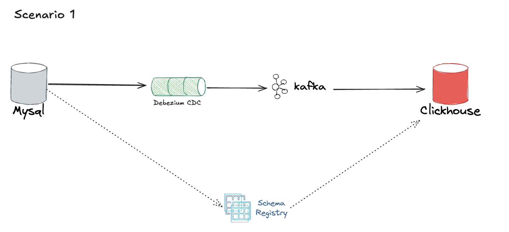
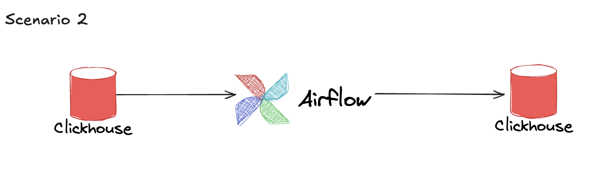
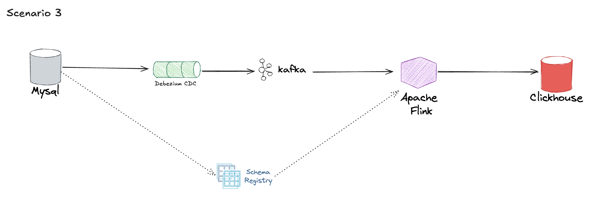

# sari
A flowing and swift data streaming system 

The project simulates a real-world scenario involving:
- **MySQL** as source database
- **Debezium** for Change Data Capture (CDC)
- **Kafka + Schema Registry** for event streaming
- **ClickHouse** for real-time analytics
- **Apache Flink** for real-time processing
- **Airflow** for job scheduler

### Scenario 1

- Data source: MySql
- Streaming system: Debezzium + Kafka + Schema Registry
- ETL system: Clickhouse

### Scenario 2

- Data source: Clickhouse
- Transfromation system: Clickhouse
- Scheduler: Airflow

### Scenario 3

- Data source: MySql
- Streaming system: Debezzium + Kafka + Schema Registry
- Transfromation system: Apache Flink

